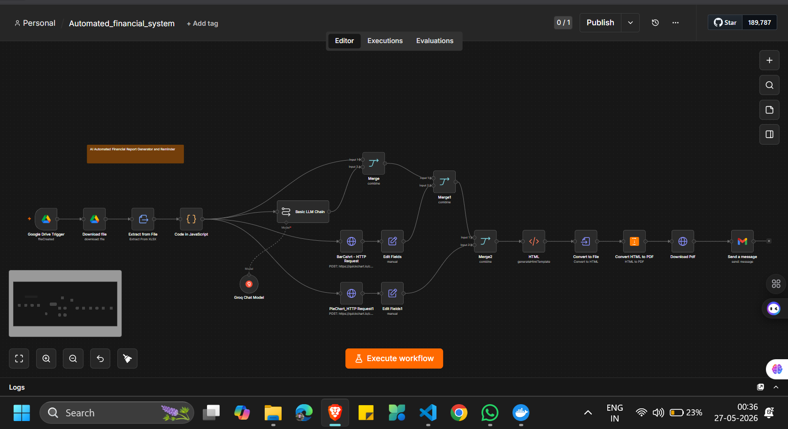
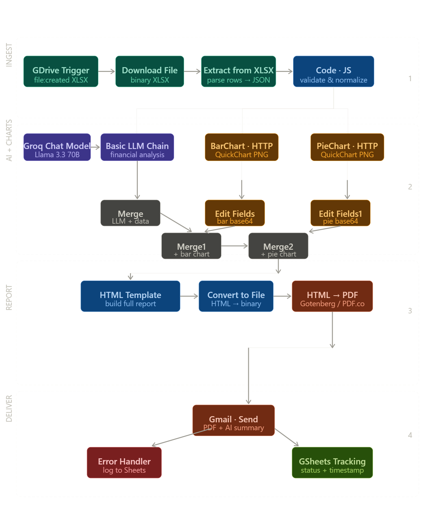
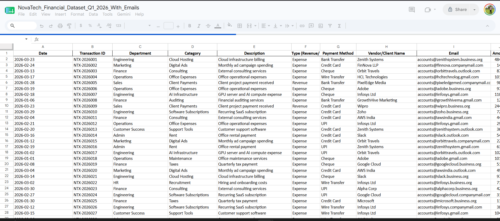
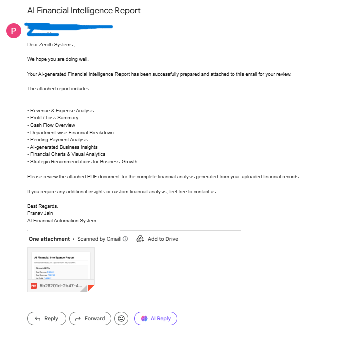

# 🚀 AI Automated Financial Report & Reminder System using n8n

<p align="center">
  <b>AI-powered financial analysis and automated PDF reporting workflow using n8n + Excel + Charts + Email Automation</b>
</p>

---

# 📌 Overview

This project is an AI-powered financial automation system built using **n8n**.

The workflow:

✅ Fetches Excel financial reports from Google Drive  
✅ Extracts company financial data from XLSX files  
✅ Uses AI to analyze profit/loss and company performance  
✅ Generates charts and company insights automatically  
✅ Creates HTML-based financial reports  
✅ Converts reports into professional PDFs  
✅ Sends reports via email to clients automatically  
✅ Updates report status inside Excel/Sheets  

---

# ❗ Problem Statement

Financial reporting and client communication are often manual and repetitive.

Businesses struggle with:

- Manual report generation
- Time-consuming data analysis
- Preparing charts manually
- Sending reports individually
- Maintaining report tracking
- Delayed financial communication

This becomes difficult when managing multiple clients.

---

# 🎯 Solution

This workflow fully automates the financial reporting pipeline.

```text
Excel Financial Data
          ↓
AI Financial Analysis
          ↓
Generate Charts & Insights
          ↓
Create HTML Report
          ↓
Convert to PDF
          ↓
Send Client Email
          ↓
Update Status
```

This reduces manual effort and speeds up financial reporting significantly.

---

# ⚡ Features

- Automated Excel processing
- AI-powered financial analysis
- Dynamic chart generation
- HTML financial reports
- PDF conversion automation
- Automated email delivery
- Client-wise reporting
- Status tracking system

---

# 🏗️ Workflow Architecture



```text
Google Drive Trigger
        ↓
Download Excel File
        ↓
Extract XLSX Data
        ↓
AI Financial Analysis
        ↓
Generate Charts
        ↓
Generate HTML Report
        ↓
Convert HTML to PDF
        ↓
Send Email to Client
        ↓
Update Report Status
```

---

# 🖼️ Workflow 



---

# ⚙️ Tech Stack

| Technology | Purpose |
|---|---|
| n8n | Workflow automation |
| Google Drive | File storage |
| Excel/XLSX | Financial data source |
| Groq/OpenAI | AI financial analysis |
| QuickChart API | Chart generation |
| HTML Templates | Report creation |
| PDF Conversion | Financial report export |
| Gmail API | Email automation |

---

# 🔄 Workflow Explanation

## 📂 Google Drive Trigger

Automatically detects uploaded Excel financial reports.

---

## 📥 Download File

Downloads XLSX financial sheets from Google Drive.



---

## 📊 Extract From XLSX

Extracts:

- Revenue
- Profit/Loss
- Expenses
- Client data
- Financial metrics

from Excel files.

---

## 🤖 AI Financial Analysis

Uses AI to analyze company performance.

Responsibilities:

- Profit/loss insights
- Financial summary
- Risk analysis
- Business overview
- Trend interpretation

---

## 📈 Chart Generation

Creates dynamic visual charts like:

- Revenue charts
- Expense breakdown
- Profit trends
- Financial comparisons

using chart APIs.

---

## 🧾 HTML Report Generator

Builds professional financial reports dynamically using HTML templates.

Includes:

- Company overview
- Financial summary
- Charts
- Recommendations
- Key metrics

---

## 📄 Convert HTML to PDF

Converts generated reports into downloadable PDF documents.

---

## 📧 Send Email

Automatically emails generated financial reports to clients.



Example email includes:

- PDF attachment
- Company insights
- Reminder details
- Due/payment information

---

## 📤 Update Status

Updates report delivery status back into Excel/Google Sheets.

Example:

```text
Pending → Sent
```

---

# 📂 Project Structure

```text
automated-financial-system/
│
├── workflow/
│   └── financial_automation.json
│
├── assets/
│   └── workflow.png
│
├── README.md
│
└── docker-compose.yml
```

---

# 📥 Import Workflow

1. Open n8n
2. Click "Import Workflow"
3. Upload:

```text
financial_automation.json
```

4. Configure credentials
5. Run workflow

---

# 🚀 Run Locally using Docker

## Pull n8n Image

```bash
docker pull n8nio/n8n
```

---

## Run Container

```bash
docker run -it --rm \
-p 5678:5678 \
n8nio/n8n
```

---

## Open n8n

```text
http://localhost:5678
```

---

# 🧩 Docker Compose Setup

Create `docker-compose.yml`

```yaml
version: '3.8'

services:
  n8n:
    image: n8nio/n8n

    ports:
      - "5678:5678"

    volumes:
      - ./n8n_data:/home/node/.n8n

    restart: always
```

---

## Start n8n

```bash
docker compose up -d
```

---

# 🔑 Environment Variables

| Variable | Purpose |
|---|---|
| `GOOGLE_DRIVE_CREDENTIALS` | Drive access |
| `GMAIL_CREDENTIALS` | Email automation |
| `GROQ_API_KEY` | AI analysis |
| `QUICKCHART_API` | Chart generation |

---

# 📊 Example Workflow Execution

```text
Excel Uploaded
       ↓
Financial Analysis
       ↓
Charts Generated
       ↓
PDF Report Created
       ↓
Client Email Sent
       ↓
Status Updated
```

---

# 🛠️ Future Enhancements

- Real-time dashboards
- Advanced analytics
- Multi-company reporting
- AI forecasting
- WhatsApp delivery
- OCR invoice integration
- Auto payment tracking


---

# 📜 License

This project is licensed under the MIT License.

---

# ⭐ Support

If you like this project:

- ⭐ Star the repository
- 🍴 Fork the project
- 🚀 Build amazing automations

---

<p align="center">
  Made with ❤️ using n8n + AI
</p>