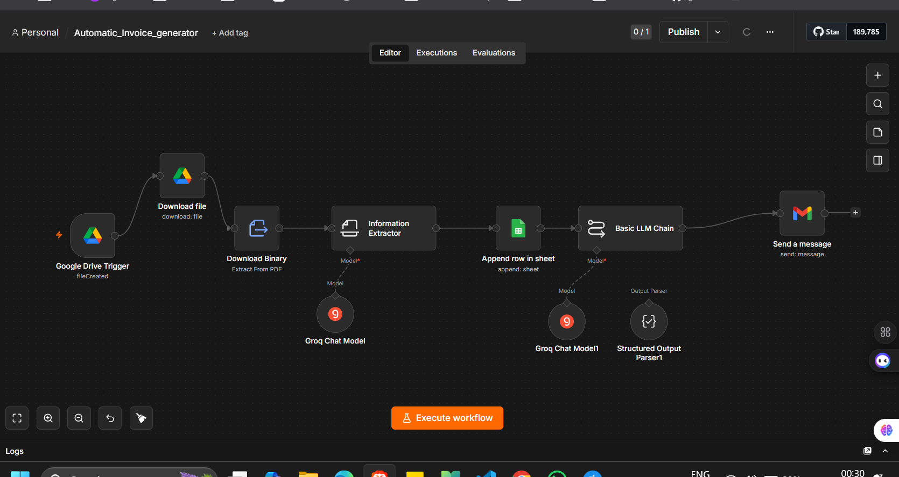
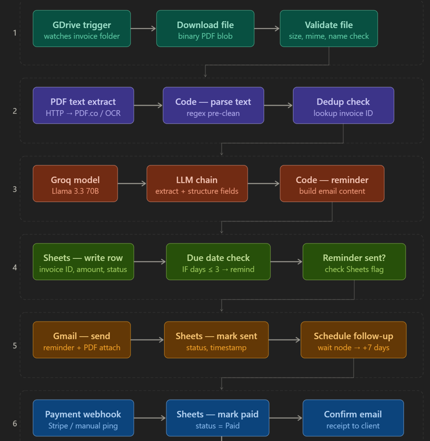
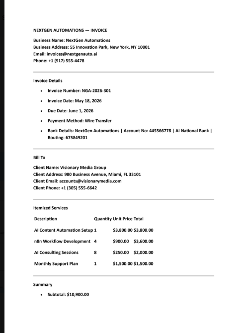
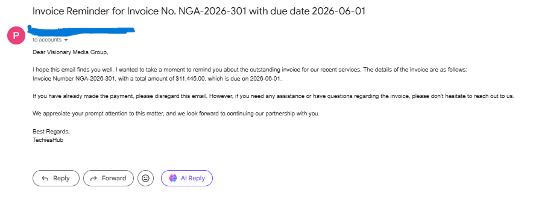

# 🚀 AI-Powered Invoice Reminder Automation using n8n

<p align="center">
  <b>Automated Invoice Tracking & Payment Reminder System using AI + Google Drive + Gmail + Google Sheets</b>
</p>

---

# 📌 Overview

This project is an AI-powered invoice automation workflow built using **n8n**.

The workflow:

✅ Detects new invoices uploaded to Google Drive  
✅ Extracts invoice data from PDFs  
✅ Uses AI to process invoice information  
✅ Stores invoice details inside Google Sheets  
✅ Sends automated payment reminder emails  
✅ Tracks payment due dates and invoice status automatically  

---

# ❗ Problem Statement

Businesses often struggle with:

- Manual invoice tracking
- Missed payment reminders
- Unorganized invoice records
- Late payments
- Manual data entry
- Follow-up management

Handling invoices manually becomes difficult as invoice volume increases.

---

# 🎯 Solution

This workflow automates the complete invoice management pipeline.



```text
Invoice Uploaded to Drive
            ↓
Extract Invoice Data
            ↓
Store Details in Google Sheets
            ↓
Generate Reminder Email using AI
            ↓
Send Payment Reminder
```

This reduces manual effort and improves payment tracking efficiency.

---

# ⚡ Features

- Automatic invoice detection
- PDF invoice extraction
- AI-powered information processing
- Google Sheets invoice tracking
- Automated payment reminder emails
- Due date management
- Structured invoice storage
- Scalable workflow architecture

---

# 🏗️ Workflow Architecture

```text
Google Drive Trigger
        ↓
Download Invoice PDF
        ↓
Extract PDF Data
        ↓
AI Information Extraction
        ↓
Store Data in Google Sheets
        ↓
Generate Reminder Email
        ↓
Send Gmail Reminder
```

---

# 🖼️ Workflow 



---

# ⚙️ Tech Stack

| Technology | Purpose |
|---|---|
| n8n | Workflow automation |
| Google Drive | Invoice storage |
| Google Sheets | Invoice tracking |
| Groq/OpenAI | AI processing |
| Gmail API | Reminder emails |
| PDF Extraction | Invoice parsing |
| Docker | Local deployment |

---

# 🔄 Workflow Explanation

## 📂 Google Drive Trigger

Automatically detects new invoice PDFs uploaded inside a Drive folder.

---

## 📥 Download File Node

Downloads invoice files from Google Drive.

---

## 📄 Extract From PDF

Extracts invoice text and data from uploaded PDFs.



Example extracted fields:

- Invoice number
- Client name
- Due date
- Amount
- Payment status

---

## 🤖 Information Extractor (AI)

Uses AI to structure extracted invoice data into usable format.

Responsibilities:

- Understand invoice structure
- Extract key fields
- Format clean outputs
- Prepare data for storage

---

## 📊 Append Row in Sheet

Stores invoice details into Google Sheets automatically.

---

## 🧠 Basic LLM Chain

Generates professional payment reminder emails dynamically.

---

## 📧 Send Gmail Message

Automatically sends reminder emails to clients before or on due date.



---

# 📂 Project Structure

```text
invoice-reminder-automation/
│
├── workflow/
│   └── invoice_automation.json
│
├── assets/
│   └── workflow.png
│
├── README.md
│
└── docker-compose.yml
```

---

# 📥 Import Workflow

1. Open n8n
2. Click "Import Workflow"
3. Upload:

```text
invoice_automation.json
```

4. Configure credentials
5. Run workflow

---

# 🚀 Run Locally using Docker

## Pull n8n Image

```bash
docker pull n8nio/n8n
```

---

## Run Container

```bash
docker run -it --rm \
-p 5678:5678 \
n8nio/n8n
```

---

## Open n8n

```text
http://localhost:5678
```

---

# 🧩 Docker Compose Setup

Create `docker-compose.yml`

```yaml
version: '3.8'

services:
  n8n:
    image: n8nio/n8n

    ports:
      - "5678:5678"

    volumes:
      - ./n8n_data:/home/node/.n8n

    restart: always
```

---

## Start n8n

```bash
docker compose up -d
```

---

# 🔑 Environment Variables

| Variable | Purpose |
|---|---|
| `GOOGLE_DRIVE_CREDENTIALS` | Drive access |
| `GOOGLE_SHEETS_CREDENTIALS` | Sheets access |
| `GMAIL_CREDENTIALS` | Gmail API access |
| `GROQ_API_KEY` | AI model access |

---

# 📊 Example Workflow Execution

```text
Invoice Uploaded
        ↓
PDF Data Extracted
        ↓
Invoice Stored in Sheet
        ↓
Reminder Generated
        ↓
Email Sent Automatically
```

---

# 🛠️ Future Enhancements

- Auto payment status updates
- WhatsApp reminders
- Dashboard analytics
- Multi-client support
- OCR for scanned invoices
- Stripe/PayPal integration
- Recurring invoice tracking

---

# 🤝 Contributing

Contributions are welcome.

Feel free to:

- Improve workflows
- Add integrations
- Optimize prompts
- Enhance automation logic

---

# 📜 License

This project is licensed under the MIT License.

---

# ⭐ Support

If you like this project:

- ⭐ Star the repository
- 🍴 Fork the project
- 🚀 Build amazing automations

---

<p align="center">
  Made with ❤️ using n8n + AI
</p>