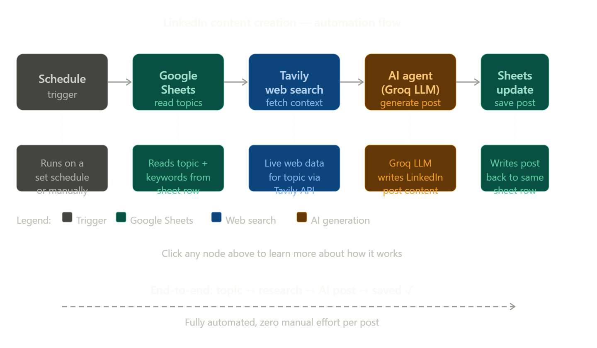

# 🚀 AI-Powered LinkedIn Content Automation using n8n

<p align="center">
  <b>Generate LinkedIn posts automatically using AI + Google Sheets + n8n</b>
</p>

---

# 📌 Overview

This project is an AI-powered LinkedIn content automation workflow built using **n8n**.

The workflow:

✅ Fetches post topics from Google Sheets  
✅ Uses Tavily API for research/context  
✅ Sends data to an AI model  
✅ Generates professional LinkedIn posts  
✅ Updates generated content back into the sheet automatically  

---

# ❗ Problem Statement

Writing LinkedIn posts consistently is time-consuming.

People often struggle with:

- Content ideas
- Research
- Writing engaging posts
- Maintaining consistency

Creating a single quality LinkedIn post can take 30–60 minutes.

---

# 🎯 Solution

This workflow automates the entire process.

```text
Google Sheets Topic
        ↓
Research via Tavily
        ↓
AI Content Generation
        ↓
Update Google Sheet
```

Users only need to add a topic inside the sheet.

The workflow handles the rest automatically.

---

# ⚡ Features

- Automated topic fetching
- AI-powered content generation
- Real-time web research using Tavily
- Automatic Google Sheet updates
- Modular workflow architecture
- Easy scalability

---

# 🏗️ Workflow Architecture

```text
Google Sheets
      ↓
Tavily Search
      ↓
AI Agent (LLM)
      ↓
Update Google Sheets
```
---

# 🖼️ Workflow Screenshot

<p align="center">
  
</p>

---

# ⚙️ Tech Stack

| Technology | Purpose |
|---|---|
| n8n | Workflow automation |
| Google Sheets | Topic storage |
| Tavily API | Internet research |
| Groq/OpenAI | AI content generation |
| Docker | Local deployment |

---

# 🔄 Workflow Explanation

## ⚡ Execute Workflow Trigger

Starts the workflow manually for testing and execution.

---

## 📄 Get Row(s) in Sheet

Fetches LinkedIn post topics dynamically from Google Sheets.

Example:

| Topic |
|---|
| AI Agents |
| n8n Automation |

---

## 🌐 Tavily Request

Fetches internet context and research related to the topic.

Improves AI-generated output quality.

---

## 🤖 AI Agent

Generates professional LinkedIn content using LLMs.

Responsibilities:

- Generate hooks
- Create engaging content
- Maintain readability
- Structure posts professionally

---

## 🧠 Groq Chat Model

Acts as the LLM backend for fast AI inference and content generation.

---

## 📤 Update Row in Sheet

Stores generated LinkedIn content back into Google Sheets automatically.

---

# 📂 Project Structure

```text
linkedin-content-automation/
│
├── workflow/
│   └── linkedin_automation.json
│
├── assets/
│   └── workflow.png
│
├── README.md
│
└── docker-compose.yml
```

---

# 📥 Import Workflow JSON

1. Open n8n
2. Click "Import Workflow"
3. Upload:

```text
linkedin_automation.json
```

4. Configure credentials
5. Run workflow

---

# 🚀 Run Locally using Docker

## Pull n8n Image

```bash
docker pull n8nio/n8n
```

---

## Run Container

```bash
docker run -it --rm \
-p 5678:5678 \
n8nio/n8n
```

---

## Open n8n

```text
http://localhost:5678
```

---

# 🧩 Docker Compose Setup

Create `docker-compose.yml`

```yaml
version: '3.8'

services:
  n8n:
    image: n8nio/n8n

    ports:
      - "5678:5678"

    volumes:
      - ./n8n_data:/home/node/.n8n

    restart: always
```

---

## Start n8n

```bash
docker compose up -d
```

---

# 🔑 Environment Variables

| Variable | Purpose |
|---|---|
| `TAVILY_API_KEY` | Tavily API access |
| `GROQ_API_KEY` | LLM access |
| `GOOGLE_CREDENTIALS` | Google Sheets auth |

---

# 📊 Example Workflow Execution

```text
Topic Added in Sheet
        ↓
Research Collected
        ↓
AI Generates Post
        ↓
Content Stored in Sheet
```

---

# 🛠️ Future Enhancements

- LinkedIn auto posting
- Multi-platform posting
- AI image generation
- Content scheduling
- Analytics dashboard
- Multi-agent AI workflows

---

# 🤝 Contributing

Contributions are welcome.

Feel free to:

- Fork the repository
- Improve workflows
- Add integrations
- Optimize prompts

---

# 📜 License

This project is licensed under the MIT License.

---

# ⭐ Support

If you like this project:

- ⭐ Star the repository
- 🍴 Fork the project
- 🚀 Build amazing automations

---

<p align="center">
  Made with ❤️ using n8n + AI
</p>